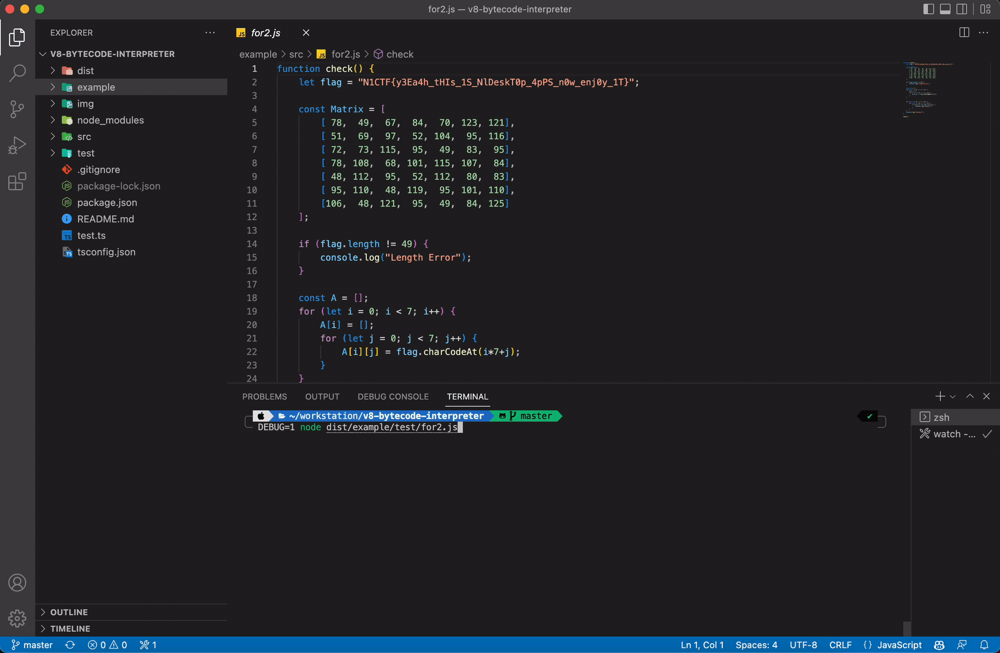

# v8 byteccode interpreter

A micro-bytecode interpreter for V8.



## Usage

Install dependencies

```shell
cd v8-byteccode-interpreter
npm install -g
```

Run example/dist/for2.txt (WithoutDebugging)

```shell
tsc -p tsconfig.json
node ./dist/example/test/for2.js
```

Run example/dist/for.txt (Debugging)

```shell
tsc -p tsconfig.json
DEBUG=1 node ./dist/example/test/for2.js
```

## Support List

| Name | Status |
| ---- | ------ |
| Ldar |   ✅  |
| LdaZero | ✅ |
| LdaSmi | ✅ |
| LdaSmi.Wide | ✅ |
| LdaSmi.ExtraWide | ✅ |
| LdaUndefined | ✅ |
| LdaNull | ✅ |
| LdaGlobal | ✅ |
| LdaConstant | ✅ |
| - | - |
| LdaFalse | ✅ |
| LdaTrue | ✅ |
| - | - |
| GetNamedProperty / LdaNamedProperty | ✅ |
| GetKeyedProperty | ✅ |
| - | - |
| CallProperty1 | ✅ |
| Return | ✅ |
| - | - |
| Star | ✅ |
| StaGlobal | ✅ |
| SetKeyedProperty | ✅ |
| - | - |
| CreateEmptyArrayLiteral | ✅ |
| CreateArrayLiteral | ✅ |
| - | - |
| TestLessThan | ✅ |
| TestLessThanOrEqual | ✅ |
| TestGreaterThan | ✅ |
| TestGreaterThanOrEqual | ✅ |
| TestEqual | ✅ |
| TestEqualStrict | ✅ |
| - | - |
| Jump | ✅ |
| JumpIfFalse | ✅ |
| JumpIfTrue | ✅ |
| JumpLoop | ✅ |
| - | - |
| MulSmi | ✅ |
| - | - |
| Add | ✅ |
| - | - |
| Inc | ✅ |

